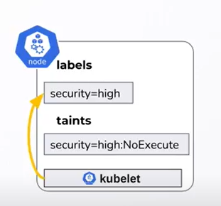

# Attaquer l'isolation d'un cluster Kube

## Attaquer l'isolation à partir de kubelet

Le Kubelet est intéressant car :&#x20;

* Il s'exécute sur l'ensemble des noeuds du cluster
* Il possède des droits sur certains composants utilisés par les mécanismes d'isolation (par exemple les labels)

### 1er exemple d'attaque :&#x20;

Ajouter des labels sur des noeuds pour les inclure dans le domaine de faisabilité

<figure><figcaption></figcaption></figure>

#### Mitigations

Activer le plugin NodeRestriction qui définit une blacklist de labels modifiables

NodeRestriction peut également restreindre les modifications sur les Taints

### 2ème exemple d'attaque :&#x20;

Kubelet ne peut pas modifier directement les Taints mais il est possible d'utiliser des "cordon" en référence aux cordons de police qui permettent de rendre "unschedulable" un noeud

<figure><figcaption></figcaption></figure>

Indirectement, une Taint est ajoutée pour indiquer au Scheduler que le noeud ne peut pas être associé à un pod.

<figure><figcaption></figcaption></figure>

Le chemin d'attaque suivant peut alors être exécuté :&#x20;

* S'échapper depuis un pod compromis
* Compromettre le noeud
* Utiliser Kubelet pour "cordon" le noeud
* Supprimer le pod

<figure><figcaption></figcaption></figure>

* Lancement d'un job de CI ou si le pod est surveillé par un ReplicaSet automatique pour recréer le pod sur un autre noeud
* Utilisation de l'exploit initial sur le pod pour compromettre un nouveau noeud

<figure><figcaption></figcaption></figure>

\-> Si le chemin d'attaque est répété, l'attaquant va pouvoir compromettre l'ensemble des noeuds du cluster et récupérer l'ensemble des comptes de service bindés sur les noeuds du domaine de faisabilité

## Attaquer l'isolation à partir de comptes de service

Si un compte de service est présent sur un noeud , il peut utiliser le droit "PATCH POD" qui ne permet pas de modifier les affinities et nodeSelector mais il permet de modifier les tolerations :&#x20;

.png>)\


Le chemin d'attaque suivant peut alors être exécuté : \
\
<mark style="background-color:yellow;">**Départ**</mark> : si on essaie de générer un token associé à un compte de service, ce sera refusé car le mécanisme nodeAuthorizer ne trouvera pas de lien entre le noeud et le compte de service

* Identifier un pod qui est contrôlé par un Replicaset et identifier quels sont les labels utilisés par le Replicaset

```
kubectl get pod -o yaml %name_pod% | less 
```

`kind: ReplicaSet`

```
labels:
    app: admin
```

<figure><figcaption></figcaption></figure>

* Supprimer le label utilisé par le Replicaset via le droit "PATCH POD" du compte de service

<figure><figcaption></figcaption></figure>

* Le label ayant disparu, le Replicaset va recréer un pod pensant que le pod n'est plus présent

<figure><figcaption></figcaption></figure>

* Les noeuds ont une propriété "Capacity" qui indique le nombre maximal de pods qu'ils peuvent héberger et quand la capacité max est atteinte, le Plugin "NodeResourcesFit" exclut le noeud lors de l'étape de filtrage
* Utiliser un script pour supprimer en boucle le label sur le pod qui est surveillé par le replicaset et remplir tous les noeuds du domaine de faisabilité du pod
* Ajouter notre toleration pour rendre notre noeud feasible et ce sera le seul car les autres noeuds du domaine de faisabilité ont été exclu par leur capacité max atteinte

\-> Le pod passe en pending

* Utiliser le compte kubelet pour modifier le label de notre noeud

\-> Le pod est bien bindé avec notre noeud

<mark style="background-color:yellow;">Arrivée</mark> : On est maintenant en mesure de créer un token associé au compte de service ciblé parce que le nodeAuthorizer trouve bien un chemin qui relie notre noeud au compte de service (via le pod créé)
